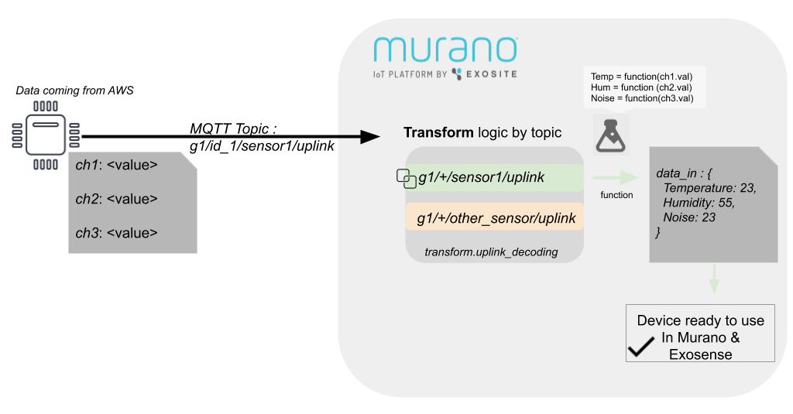
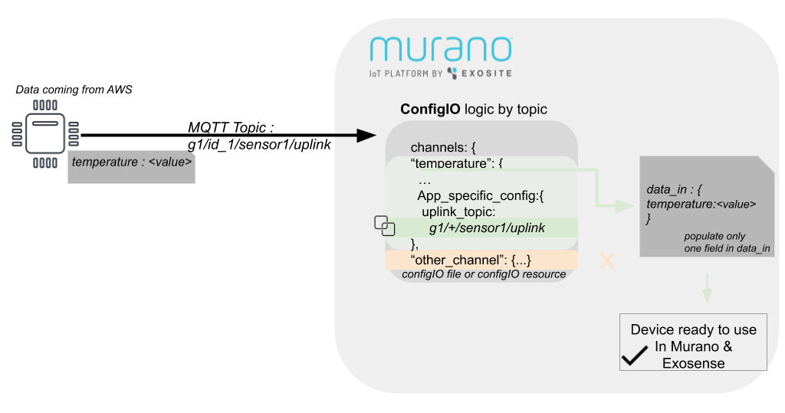
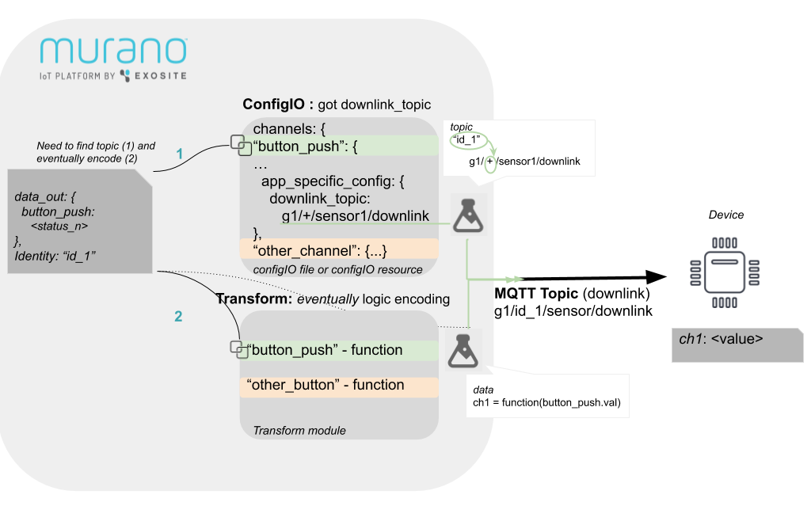

#  AWS IoT-Core Connector

This project is a template of Murano IoT-Connector for AWS IoT integration.

See related documentation on http://docs.exosite.com/connectivity/cloud2cloud/

## Table of Content

- [Using this project](#using-this-project)
- [Start synchronizing with AWS IoT](#start-synchronizing-Murano-with-aws-iot)
- [Get Uplink](#get-uplinks)
- [Synchronize with Exosense and send downlinks](#send-downlinks)
- [Questions / Answers](#questions-answers)
- [Types of Integration](#types-of-integration)
- [Customization](#customization)
  - [IoT-Connector integration](#iot-connector-integration)
- [Known limitations](#known-limitations)

---

## Using this project

**This is a project dedicated to AWS IoT. Will work using MQTT Client service.**
This cloud integration has its particularity and is not a generic plug&play solution.

This project is build around uses 2 main modules [_c2c.cloud2murano_](./modules/c2c/cloud2murano.lua) to handle incoming data & [_c2c.murano2cloud_](./modules/c2c/murano2cloud.lua) for outgoing. Device state uses the [Device2 Service](http://docs.exosite.com/reference/services/device2) and [_vendor.c2c.transform_](./modules/vendor/c2c/transform.lua). Logic is to map incoming data and provision devices in Murano, with a transformation pipeline.


**Deployment & Auto-update**:
This template disables auto-Deployment by default. However for each integration we suggest enabling `auto_update` by default in the ./services/config.yaml file.

---
## Start synchronizing devices with AWS IoT

This solution enables MQTT protocol through a service : _Mqtt_. 
By using this template, start filling some AWS credentials and certificate values. In `service`-> `Mqtt`, which contains blank fields initially. Set up is important and all steps must be followed carefully. Initially, user should have an AWS account with access on IoT-Core, and should open *AWS IoT Core dashboard page*. Then will create a new *Thing*, which will become a message broker between Murano and your real devices on AWS side. Let's start , and please also read carefully paragraph "Important".

 
  *AWS Iot Dashboard*
  1. First, in *AWS IoT dashboard* page -> `Settings` check **Endpoint address**. Make sure it is enabled. Back to `service`on Murano, must be copied in the `Host` field. Then second field is `8883`. 

  1. In *AWS IoT dashboard page*, click on `Secure` -> `Policies`. Then choose to **Create**. First write a title *AwsPolicy* for ex. and fill these fields:
  \- in `Action` : `iot:*`
  \- in `Resource ARN` : `*`
  Check the `Allow` case and `Create`.

  1. First, make sure you have a `Certificate`. Click on `Secure` -> `Certificates`. Choose to **Create**, then **One Click certificate**.

  1. On the window, click first on `Download a root CA AWS IoT`. It will redirect you to a new window. **Important don't close the former window**. Here Choose `VeriSign Class 3 Public Primary root CA certificate`. This string key corresponds to `Root CA` field in `sslOptions` from *Mqtt Client* service. Copy and paste string value.

  1. Switch to the previous AWS window, and download `certificate` and also `private key` files . Open them in a *code editor* and copy-paste string value respectively in `certificate pem` , `private key pem` inside `sslOptions` from *Mqtt* service.

  1. Don't forget to click on **activate** on the same window.

  1. *A device is a Thing in AWS IoT*. It is configured in `Manage` -> `Things` from *AWS IoT dashboard page*. Add one, which will contain the Certificate and policy. It is that way that Murano template will be able to communicate (send Downlink or get Uplink) like a device, and this *Thing* will become like a broker.

  1. Still on `Secure` -> `Certificates`, click on *option button* on your new certificate, and `Attach policy`. Attach the policy created.
  Choose also `Attach thing`. Attach things needed to communicate with MQTT.


**Important** : 
Add also some topics on which to subscribe on.
"+" is a wildcard enabling you to subscribe to all of the topics that are containing any characters at this path level, which is useful. In most case, it replaces *identity* entry of device in the topic path. You can add several "+" per field.

Now, any incoming message will be sent and interpreted in `cloud2murano`. And `vendor/c2c/transform` has a role of parser module, and can transform data, to be used in exosense (**except if your device send explicit and readable values**). Please note you have to fill first a part in `vendor/c2c/transform` module or add a field in `vendor/c2c/configIO`. Details are explained in the next part.


---
## Get Uplinks
 
This template handles different kind of devices: those sending on one topic different *channel* with eventually a need small *transformation* of its values, and those communicating sending on a *single* channel with *ready to use value*. Remember It is compulsory to declare your uplink topic to be able to track a device on Murano and get **data_in** from it. Here is set up :

At any time, you can refer to these two diagrams to help you.
The first case, if there are different *channels* on same uplink and/or need of *encode* some value before getting it.

Case 1 : Go to `transform` module (`vendor/c2c/transform.lua`). Inside `uplink_decoding` add a key which is a pattern of your `uplink topic` using this *wildcard*: replace `id device` entry with `+`. You have to write up a function associated with the key that will decode your data, and create explicit channels name using provided channels, like in this example with `ch1`, `ch2`, `ch3` that will become `Temp`, `Hum`, `Noise`, to be set in **data_in**. Last information to know is that each channel must be described in `configIO` module (`vendor/configIO.lua`) in Exosense.

The second case is if your device sends on a *single channel* a *readable value* so that you don't need to decode anything:

Case 2 : as it is described in this second example, you need to set a logic, as each uplink is linked with a specific channel (associativity in the second case is 1 to 1). Set a pattern of your `uplink topic` inside your *channel definition* of your `ConfigIO` module (`vendor/configIO.lua`). For this, fill `protocol_config`.`app_specific_config`.`uplink_topic`, make sure you add `+` (*wildcard*) to create a topic pattern that will match any `device id`.

Note also that if you have a specific `configIO` resource on your `device`, it will be considered a second priority, but can be useful if you want to define a specific uplink associated with your device. In that case you don't need to add `+` but enter explicit value.
When receiving messages, it will initially create devices, and then update its resources with further incoming data. You can see available devices in the `Devices` tab from the App. incoming data is filled first in the `data_in` resource.

---
## Send Downlinks

Before sending any message to device, the template must rely on a downlink declaration, specific for channel you're taking control on it. The relation between topic and channel is similar to previous setup with `uplink_topic` in `configIO`. On your ConfigIO, you have to add a field for declaring downlink, depending on your channel. Any control over a resource (like a trigger On/Off Panel on dashboard on a device in Exosense) will generate a new **data_out** resource on Murano side. Then message will contain a `channel` name, and it is used to find the associated `downlink topic` to send the Mqtt message. The following diagram will help you to understand logic. All details are explained below:



  1. If there is no specific case per device you can change the global ConfigIO file under `modules/vendor/configIO`. Add a Downlink address depending on a `channel` name, fill `protocol_config`.`app_specific_config`.`downlink_topic`. As for uplink device topic definition, you will need to replace your device `identity` with `+` which is like a *wildcard*, in the pattern definition. That will be automatically replaced when generating a mqtt downlink message for a specific identity of device. 
  1. Set a specific setting for your channel in ConfigIO as it is one you have control on it. Simply add a boolean (`true`) in `properties`.`control` of your channel definition.
  1. Second logic is not compulsory, but if you need to encode your data and change the field name: add a function in `downlink_encoding` from transform module (`modules/vendor/c2c/transform.lua`). Logic is slightly different from uplink decoding as the `key` is the `channel` on which you're controlling it and not the topic name.


Note also for controllable channels, devices can perform acknowledgment message. If needed, you should add these topics in Mqtt client service to subscribe to them. You can then manually see them in `Logs` on Murano.


**Post Scriptum**
File `ConfigIO` in `vendor` is not synchronized with Exosense, it must be just a generic pattern, that will be personalized in Exosense in a second time for each device.

This template will mock acknowledgment event when changing *data out* in exosense. In fact, by changing one value in Exosense (to create a downlink message to the device) the platform will rely on a quick acknowledgment from the device. But on its side, LoRaWAN protocol has another priority for this. Basically, the device will get downlink messages quickly, but acknowledgment isn't managed on the device side.

For some reason, if you want to redirect a bunch of topics to another one, you have to create a Rule to republish desired topics to your device or murano (bi-directional). [See there: use republish part](https://docs.aws.amazon.com/iot/latest/developerguide/iot-rule-actions.html).

This template uses cache for store values (ex. channel associated with your topic device). Inside this cache strategy, it relies on Keystore access with cache validity. So that it prevents calling too many times a state of device in murano, that can be expensive and impact performances. Please keep in mind the actual valid time cached in Keystore is set to 5 minutes. On your Murano app, you can go under `Settings` and choose `ENV VARIABLES`. Define time in sec when cache is valid : add One variable with followings settings :
**Key** = KEYSTORE_TIMEOUT
**Value** = *<Your timeout in sec. ex: 300>*

---

## Questions Answers

*How I can write lua code to decode or encode inside transform module ?*
**Transform** module from *vendor* folder is safe and persistent, you should add your decoding and encoding logic inside. Add your logic given the channel name, in `downlink_encoding` or `uplink_decoding`. It will rely on some functions that parse bytes. A library is provided in `bytes/parser_factory` for general cases like decode *floats*, *char*. Or encode *boolean* in hex value.

*Should I configure something if my device sends uplink without identity field* ?
With or without *identity* field, both case supported:
- Your device has a field identity in uplink : nothing to do !
- Your device doesn't have, no worries. Because you provided a *wildcard* "+" on *subscribed topics* in **Mqtt client service**, an automatic process will associate the "+" with the *device id* contained in the path (uplink topic), when topics are matching.
You can have unexpected results in the following case: you defined one of *subscribing topics* with at least 2 wildcards "+" or you defined explicit topics without *wildcard*. The identity will be the full path then.

*What are resources filled on my devices, is there a description ?*
A description of device resource can be explained here: 
  - **data_in** : readable data  with channel name(s), after eventual decoding, that is ready to be used by exosense.
  - **data_out** : A message from Exosense, that is sent to device, after eventual value encoding .
  - **config_io** : Metadata describing relevant device data capabilities, like port used and channel name it has. It is used by Exosense too. If uses device control, will necessarily means enable *control* boolean. It is possible to give a pattern of downlink and ack topics also.
  - **uplink_meta** : All raw information got on the last uplink.
  - **ack_meta** : All raw information got on the last device acknowledgment topic. After you send a downlink requiring acknowledgment.

*How can I use Exosense to send messages to my device ?*
  In Exosense you need to create a template associated with your channel on which you have control on it. It will be possible to generate a downlink to your device then. Follow these steps: 
  1. In Exosense, make sure to confirm your devices and add them to your group. For this, on `Devices` tab on navigator, choose `Unused devices` and add **assign to a group** then, like on following screen:
    

  1. Now, on *Device* tab in navigator, select one device. In *Channels* menu choose your resources:
      

  1. This step is not compulsory, do it if you haven't defined yet global `ConfigIO` and want to add a per-device logic for downlink.
  Fill eventually `app_specific_config` with:
      ```
      {
        "downlink_topic": "<downlink_topic_of_your_device"
      }
      ```
      Because it is a per device topic, you don't need to use a pattern address, but the explicit value. Make sure also in `Advanced`, `control` is set to `true`. Don't forget to save your new defined channel.

  1. Is it time to create an *Asset*. (You'll have then a dedicated *Dashboard* to visualize and interact on your device through a nice UI. It is made of different *panels*, dedicated to a specific thing like metrics, plot, table...). Once you modify your new asset, add your device, that will expose all of its channels (to be used in Dashboard then) In step 2, you added *control* field on your channel. Edit it again in this asset : 
    -Set **Report Rate** and **Timeout** to 5000 ms. This screen picture will help you to create and save it.
  

  1. This resource can be modified in dashboard, just add a panel. For this, back to `Dashboard` click on "+" on the right and choose `Add a panel`. Choose **ControlPanel**. 

  1. Choose this resource you want to take control of.
  

  1. You can generate **data_out** with this panel and catch it in Murano !

*How can I generate downlink without Exosense ?* 
Another way is to simulate a change, and send downlink to your device is following: by sending *data_out* data. For this, you can send JSON, caught in a new declared `Endpoint` from your App. See a detailed documentation about [create an endpoint in Murano App](http://docs.exosite.com/development/quickstart/#1.-first-endpoint).
  - A simple call to `setIdentityState(<your json body>)` from `c2c/murano2cloud` to simulate Exosense control, will change *data_out* resource as well as send Mqtt messages on topic dedicated for downlink. Make sure your body request, in JSON follows this structure : 
  ````
  {"identity": "<identity_of_your_device>",
    "data_out": 
      "{
        \"<Your channel name>\": \"<A new value in this channel>\"
      }"
    }
  }
  ````
 This endpoint is temporary if created from Murano App, and can be lost in further Auto-update from solution.

---

## Types of Integration

The Type of Connectivity for AWS IoT using Mqtt Client service is the 3rd. This figure summarizes all the process :


---

### Customization

You can also provide some tooling for the template user to extend your integration.
While you want to be able to provide new version of your template you need to avoid erasing some of the template user changes.
For this purpose we defines a `safeNamespace` for the user (in [murano.yaml](murano.yaml)) every items (modules, endpoints & assets) start with this name will not be remove nor modified by template updates.

User can then safely modify the [modules/vendor/c2c/transform.lua](modules/vendor/c2c/transform.lua) to change the data mapping or even add new public APIs (under `/vendor/*`) to extend the product capability.

If the user don't want to get update, automated updates can be deactivated on the Product `Services -> Config` settings.

_IMPORTANT_: To get persistent product state, related resources needs to be defined in the device2 service resources.
While editor of this template can change the default setup in [services/device2.yaml](services/device2.yaml) (default setup for Exosense compatibility) are needed by the user from the Product page under `Resources` all resources must have the option `sync` set to `false`!


#### IoT-Connector integration

This template can be extended as an IoT Connector (PDaaS) to provide & publish product instance to multiple internal and external applications.

Assuming you have a workable 3rd party cloud integrated and followed above sections.
1. Create a new branch or repo to keep the stand-alone version.
1. Clone the Iot Connector (https://github.com/exosite/pdaas_template) repository.
1. Merge Modules, Assets (`dist/` in folder `app`) & Endpoints: Different namespaces are used and you should be able to copy all modules files into your project modules.
1. Merge Services: some files will overlap, here are rules to follow :
    - config.yaml can be replaced.
    - in device2.yaml, copy only non overlapping `names` in resources and merge manually the rest (`tags_schema`).
1. In murano.yaml, copy from Pdaas file following parts into target :  
    - add non overlapping `safeConfigs` lines.
    - add endpoints definition and assets, and change `location` to target correct folder.
1. Merge init.lua manually.
1. Push your changes to the PDaaS-Cloud2Cloud product branch.
1. Publish the new template to Murano Exchange as described above.

---

### Known limitations

- Exosense `config_io` is fixed (in [modules/vendor/configIO.lua](modules/vendor/configIO.lua)) and cannot be modified per device, that's why it must be configured on Exosense.
